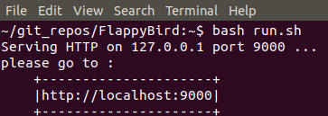

<p align="center">
    <br>
      
    <br>
  <h1 align="center">
    Super Flappy Bird :fire:
  </h1>
</p>

<br>

<p align="center"> You can play Super Flappy Bird on our website <a href="https://weikaiwei.com">都會阿嬤 weikaiwei.com</a> <br><br>https://weikaiwei.com/FlappyBird/ </p>

## Demo
<p align="center">
    <br>
      
    <br>
</p>


## Quick Start
<b>Start The Game</b><br>
```
$ bash run.sh
```


<b>Start Screen</b><br>


* Press the spacebar to start the game!
* Click  to mute the sound effect in the game.
* The color of the bird and the backgound will be randomly generated in the beginning.
<br>

## How To Play The Game

<b>Playing</b><br>


* Press the spacebar to fly higher.
* Touch the fire  
  , then the bird will be invincible  
  and fly through the pipes.
* The score at the left bottom corner is the realtime hightest score.

<b>Gameover</b><br>


* Hit spacebar to start a new game!
* The highest score will be saved.
